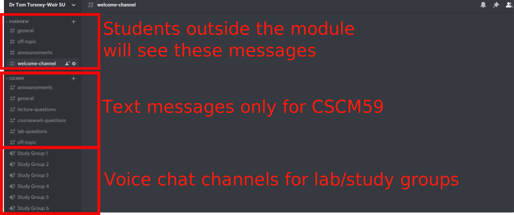

# Intro

When the lockdown initially happened last year, I had to move my lab sessions
(along with the rest of my teaching) online. For both, I took the university
recommendations and used Zoom for both. The zoom lectures went ok, especially
once I figured out how to have the chat window at the same time as sharing my
screen. However, the labs were always a mess. This semester I tried using
Discord (https://discord.com/) to run the labs and it worked far better.

During the one-hour lab session students are given a short task at the
beginning of the session that they are expected to complete by the end of the
session. During this time they can get hands-on from a support team consisting
of myself and several demonstrators. In face to face labs we walk around,
check in on students, and offer help. Students usually work in groups and help
each other as well.

When the lockdown started, I decided to try and do the labs on zoom using
breakout rooms to divide the students into groups. As a student approached for
help, we assigned them to a breakout room with a demonstrator or myself.
Basically, this was just a technological substitution (in SAMR model terms) of
the lab environment.  However, this did not work well at all. Once someone is
assigned to a breakout room, it is not easy to leave it. If I was in a breakout
room, there was no way to assign students to other demonstrators or even see
if any students were waiting in the lobby. We got through the rest of the 
semester but this year I wanted to try something better.

In my module this semester we used [Discord](https://discord.com/) for labs and
general communication. Discord is a messaging service that is always running.
It also has voice channels which also support video and screen sharing. Both
myself and the demonstrators monitored the channels and tried to answer
questions there. Students were also encouraged to answer each other's questions
and support each other. This would create a functional improvement over the
previous semester's attempt (augmentation).

I created a single server for all students. Each module
is a separate section in Discord. I used permissions so students could only see
posts from the modules they are taking. I ended up using a discord bot which
could automatically permission students. 

Discord has text and voice channels. The text channels are nice for asking 
and answering questions as they come up. If one posts in the overview category,
these will go to all students that are on my server, not just those in a single module.
To help organize things a bit I created channels for various aspects of the
module: lectures, labs, coursework, and off-topic things.

The voice channels are a really nice feature of discord where you can join a
voice channel but not lose context with the rest of the discussion. I made 30
of these voice channels. The intention is that students could self-select
groups and work together in a voice chat. This let them form small groups
during the lab sessions to discuss the problems with each other. The
demonstrators and I will moved through these sessions during the labs to see if
any help was needed.

It worked fairly well this semester. It certainly worked better than the zoom
method! I still got a number of private emails and messages asking for help
and only about 5-10% of the students used the chat groups regularly. I also am
not sure of the value of having a single server for all my students. It made
joining the server much more difficult for the students and myself. One server
per module might work better in the future. Either way, it's a very nice and 
very adaptable platform that I want to explore more, especially the bots. This
is moving in the direction of the modification stage of the SAMR model.

